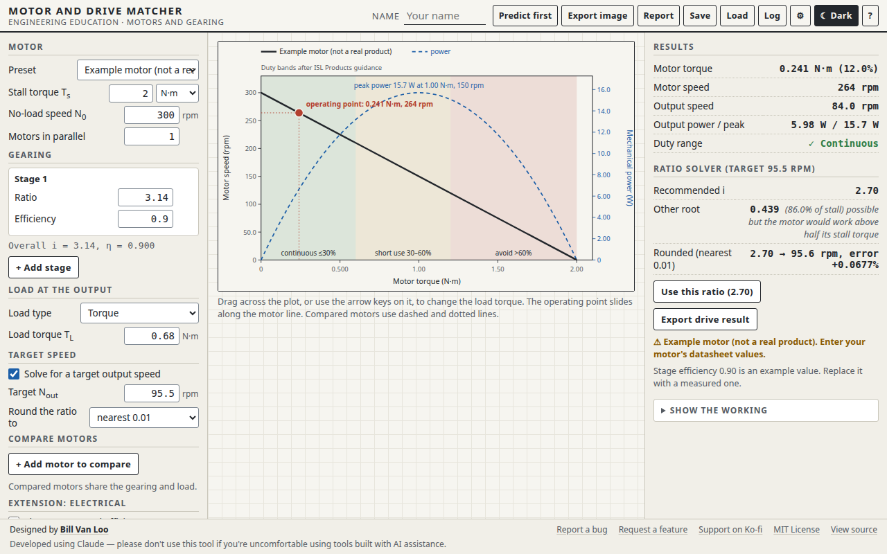

# Motor and Drive Matcher

A browser tool for matching a DC motor to its job. Students describe a motor by two datasheet numbers, the stall torque and the no-load speed. They add gearing and a load, and see where the motor actually runs. The tool then solves for the gear ratio that hits a target output speed *under load*.

This is aimed at the most common capstone mistake: choosing the ratio from the no-load speed, which makes the machine run slow.

Part of **[Engineered by the Numbers](https://github.com/billvanloo/EngineeredByTheNumbers)**, a Principles of Engineering unit (modules 1 and 5).



## Quick start

**Online:** enable GitHub Pages for this repo (Settings → Pages → Deploy from a branch → `main`, `/ (root)`) and share the URL.

**Offline:** download `index.html` and open it in any current browser. It's one self-contained file with no network calls, and works on a Chromebook.

## What students do

- **Motor.** Enter the stall torque (in N·m, N·cm, oz·in or kg·cm), the no-load speed, and one to four identical motors in parallel. Or pick a motor from the teacher's list.
- **Gearing.** Up to four stages, each with a ratio and an efficiency.
- **Load.** A torque, a force at a radius (pulley or wheel), or a mass lifted on a spool.
- **Plot.** The torque-speed line, the power curve, and duty bands (continuous up to 30% of stall, short use to 60%, avoid above). The operating point is marked. Drag across the plot, or use the arrow keys, to change the load.
- **Ratio solver.** Both roots of the loaded-speed quadratic. It recommends the one that keeps the motor below half its stall torque, and says clearly when no ratio can reach the target. The recommendation can be rounded (0.01, 0.1, whole number, or the nearest two-gear pair), with the resulting speed error.
- **Compare.** Up to two more motors on the same plot, in dashed and dotted lines.
- **VEX pull test.** Predict how hard a VEX vehicle can pull on a fixed force sensor. Pick the V5 Smart Motor (11W) with a red, green or blue cartridge, a wheel (2.75" or 4" traction, 200 mm travel omni, or a measured radius), the vehicle mass, the share of weight on the driven wheels and the measured friction coefficient. The tool gives the motor-limited and traction-limited pulls, which one decides, the crossover ratio past which more gearing adds nothing, and the mass needed to use a given ratio. A chart shows pull against gear ratio, and a measured sensor reading is compared with the model.
- **Extension.** Current and motor efficiency, from the supply voltage, no-load current and stall current.
- **Predict first.** The output speed, the motor torque as a percent of stall, and the recommended ratio stay hidden until the student predicts and presses Check. Every attempt goes to the prediction log.
- **Show the working.** T<sub>L</sub>, T<sub>m</sub>, percent of stall, N<sub>m</sub>, N<sub>out</sub>, and the quadratic with numbers substituted and both roots, each with its source.
- **Saving and exports.** Save and Load design files; export a PNG (2×, ink on paper, with a caption); print a report; export the prediction log (JSON or CSV).

## Teacher notes

- **Motor list.** It ships with one motor, clearly labeled *Example motor (not a real product)*: 2 N·m stall torque, 300 rpm no-load speed. Add your class motors in Settings as JSON, for example `[{"label": "Kit motor A", "stallTorque": 0.35, "noLoadSpeed": 150}]`, with torque in N·m and speed in rpm.
- **Example efficiency.** Stage efficiency starts at 0.90, an example value; students should measure their own. The model treats efficiency as constant, and the help panel says so.
- **Duty bands.** The 30% and 60% edges come from one gear motor maker's guidance (ISL Products). You can change them in Settings.
- **VEX pull test.** The V5 presets use VEX's 2.1 N·m stall torque for the red 36:1 cartridge, scaled by the cartridge ratio (1.05 N·m green, 0.35 N·m blue); they are always listed, alongside your own motors. The 150 rpm velocity setting in the class program does not limit a static pull: the held motor runs at its current limit and gives stall torque. The help panel explains this and how students measure μ with the force sensor. A measured pull is saved in the prediction log (the `measured` column, with its percent difference from the model) on the student's pull prediction for the same design, so the log export shows predicted, model and measured side by side. Design notes are in [`docs/spec-vex-pull-test.md`](docs/spec-vex-pull-test.md).
- **Model scope.** Version 1 models a permanent-magnet brushed DC motor at constant voltage. PWM speed control, heating, acceleration time and brushless motors are not modeled.

## How it connects to the other tools

| File | Direction |
|---|---|
| `drive-request` JSON | **In**, from the Gear Train Workbench and the Conveyor Designer (load torque, target speed, optional stages and motor) |
| `drive-result` JSON | **Out** ("Export drive result"), with the chosen ratio, operating point and duty band, back to those tools |
| `prediction-log` JSON/CSV | **Out**, to the Prediction Log Collector |

The formats are documented in [`EngineeredByTheNumbers/ecosystem/schemas.md`](https://github.com/billvanloo/EngineeredByTheNumbers/blob/main/ecosystem/schemas.md).

## Development

```
node dev/test.js          # 84 checks: every spec test case MD-1 to MD-11 and VP-1 to VP-9, plus the interface helpers
node dev/verify-html.js   # inline code in index.html matches dev/core.js and dev/vendor/; runs spec cases on it
node dev/e2e.js           # 119 browser checks in headless Chromium (needs Playwright, see below)
```

- **Where the code lives.** `dev/core.js` is the tool's calculation layer: units, load types, rounding, working steps, and the drive-request and drive-result files. `dev/vendor/` holds shared code from the Engineered by the Numbers `ecosystem/`: the motor model, the tool shell, the prediction log and the file schemas. Don't edit vendored files here. Change them in the EngineeredByTheNumbers repo and run its `scripts/sync-vendor.js`.
- **Changing the core.** Edit `dev/core.js`, run `node dev/test.js`, then `node dev/verify-html.js --fix` to copy it into `index.html`.
- **Playwright for the e2e checks.** It isn't a project dependency. Once, from the repo root: `npm i --no-save playwright && npx playwright install chromium`. You can also set `CHROMIUM_PATH` to an installed Chromium.

The spec this tool was built from is in [`docs/spec.md`](docs/spec.md), with the shared conventions in [`docs/conventions.md`](docs/conventions.md).

This was built using Claude. Please don't use this tool if you have qualms about using code created with AI tools.
